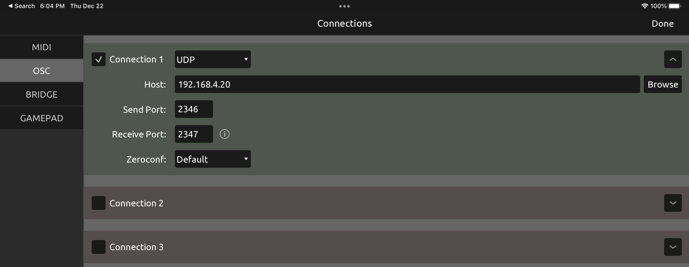

# m4l-Bluhand
## An auto-labeling control surface for Ableton Live and TouchOSC that follows the currently selected device.

This is a Max For Live device and a pair of TouchOSC layouts that provide a control surface that auto-labels parameter controls when a device is selected in your Ableton Live set.

### Changelog

* v1 - [zip](https://github.com/zsteinkamp/m4l-Bluhand/raw/main/frozen/Bluhand-v1.zip) - 2022-12-22 - Initial release.

## Installation / Setup

If you just want to download and install the device, then go to the [frozen/](https://github.com/zsteinkamp/m4l-Bluhand/tree/main/frozen) directory and download the newest zipfile there. You can also download directly via the links in *Changelog* above.

You will need to have the [TouchOSC](https://hexler.net/touchosc) app installed on your iPad and configured to talk with your computer, along with the appropriate `.tosc` file on the iPad. Instructions for that are below.

If you want to use the non-frozen device (e.g. to do your own development) you will need to install the `zero.*` package. To do this, open the Package Manager in Max, then search for 'zero'. The package to install is called `zero` and it is published by Cycling '74.

## Usage

Add the Bluhand device to any track in your Live set. As you then click around
to different devices in the set, the iPad should reflect the set of parameters
that the device provides.

### TouchOSC (iPad) to Computer Connection

You will need to configure TouchOSC to send OSC to your computer. Bluhand advertises itself on your network, so you should be able to open TouchOSC's Connections config (the chain icon), Tap OSC, then in Connection 1, tap Browse (1). You should see Bluhand in the dropdown list (2). Tap it, and then tap the IPv4 address (e.g. 192.168.x.x:2346) in the flyout menu (3).

NOTE: Max/MSP and Max For Live are limited to only working with IPv4 addresses. If you pick an IPv6 address (e.g. `[fe80:xxxx:xxxx:xxxx:xxxx%en0]:2347`) it will not work.

Make sure the "Send Port" is 2346 and the "Receive Port" is 2347.

### Computer to TouchOSC (iPad) Connection

Bluhand uses OSC (not MIDI) to communicate parameter/device/track names and values to TouchOSC running on the iPad. It uses service auto-discovery (zeroconf) to know what OSC devices are on the network. The dropdown list should contain your iPad. If not, you can edit the Host and Port boxes manually.

## Common Problems

#### I get a "Spinning Beach Ball" when I try to use zs-Knobbler3.
This usually means that the Host value is incorrect or the iPad is not turned on, or TouchOSC is not running. Max will do this if it is waiting for a DNS lookup to finish. Either fix the name, or use the IP address of the iPad.

## TODOs
* ...
